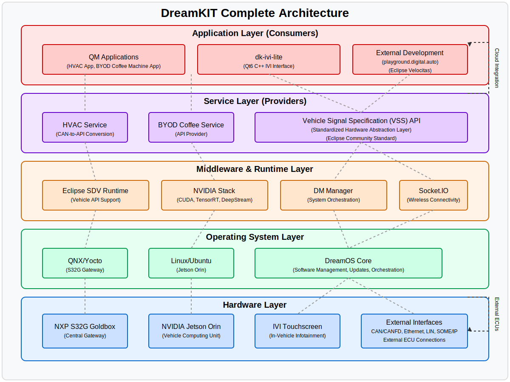

# DreamKIT Repository Overview

## What is dreamKIT?

DreamKIT is a proof-of-concept (PoC) hardware platform designed for Software-Defined Vehicle (SDV) applications. It provides a physical device to test SDV features that were initially developed in virtual environments, helping bridge the gap between exploration and productization phases.

## Key Components

The digital.auto dreamKIT includes:
- A vehicle computing unit
- A central gateway
- A mock-up in-vehicle infotainment touch screen
- CAN and Ethernet interfaces for connecting external devices
- Support for Zonal E/E Architecture network topology

## Hardware Specifications

1. **NXP S32G Goldbox**
   - Supports connectivity to embedded hardware through CAN, LIN, and SOME/IP
   - Runs either QNX or a Yocto-based build
   - Provides foundation for real-time applications
   - Enables complex E/E architecture designs

2. **NVIDIA Jetson Orin**
   - High-performance AI-capable vehicle computer
   - Used for developing UI, AI, and QM applications
   - Features CUDA cores for automotive AI testing
   - Leverages NVIDIA software stack (CUDA, TensorRT, DeepStream)
   - Internet connectivity for cloud integration (FOTA, SOTA, SDV solutions)

## Key Features

- Seamless integration with playground.digital.auto
- Built-in SDV runtime environment powered by Eclipse SDV solutions
- Easy customization of zonal E/E architecture
- Simple connection to AUTOSAR embedded ECUs
- Over-the-air (OTA) configuration capabilities
- Complete device setup for feature development
- Support for components from cloud to ECU

## Repository Structure

The repository contains the following components:

1. **Core System**
   - dreamos-core: Core component to manage the whole system
   - dm-manager: C++ application that orchestrates the system (swupdate, software installation)

2. **User Interface**
   - dk-ivi-lite: Simple IVI written in Qt6 C++ to provide a user interface

3. **Installation**
   - installation-scripts: Scripts to set up new dreamKIT software from scratch
   - jetson-orin: Installation guide and scripts for Jetson ORIN
   - nxp-s32g: Installation guide and scripts for NXP S32G

4. **Sample Applications (QM apps)**
   - BYOD-coffeemachine-app: App to trigger coffee machine when you open your door in the morning
   - dreampack-HVAC-app: App to control HVAC dreamPACK

5. **Services**
   - BYOD-coffeemachine-service: Service providing API to control coffee machine
   - dreampack-HVAC-CAN-provider: Service providing API to control HVAC dreamPACK (converts CAN signal to vehicle API)

## SDV Alliance Connection

DreamKIT is a candidate for the SDV Alliance Integration Blueprint. It's being used in multiple international showcases and co-innovation challenges for software engineers.

## Getting Started

If you want to work with dreamKIT:

1. **First Time Setup**: If your hardware doesn't have DreamOS installed, follow instructions in /installation-scripts
2. **Explore Examples**: Experiment with sample services and apps in /services and /apps directories
3. **Create Services**: Build your own services to expose APIs for hardware/features
4. **Build QM Apps**: Use the APIs to create cross-platform QM applications
5. **Connect and Extend**: Integrate your app with cloud services or UI apps

## Example HVAC dreamPack

The repository includes an example HVAC dreamPack with standard inputs and outputs to help get started with Vehicle APIs, providing a practical starting point for learning and experimentation.
